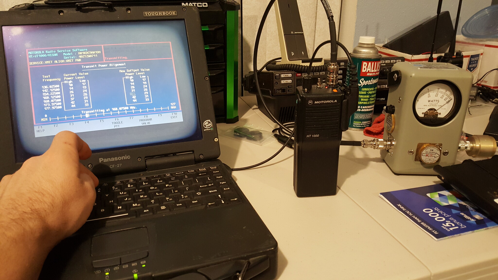

# Ham Radio RF Toolbox

A new school solution for old school surplus Part 90 radios.

## Background Information:

This project started many years ago with an old Pentium III 500Mhz Panasonic CF-27 Laptop that I salvaged from FleaBay junk I procured on the cheap. I built a custom legacy dual boot [MS-DOS 6.22](https://winworldpc.com/product/ms-dos/622) which ran [Direct Access 5.19](https://winworldpc.com/product/direct-access/5x) Menu Program &amp; Windows XP SP3 OS specifically for surplus radio programming and service. It was a nice little custom build for what it could do.

As a new ham at the time, I was interested in having a way to flash my own surplus radios that my friends and I all had laying around. We had a bunch of old /&#92;/&#92; Motorola VHF & UHF Genesis Handhelds, Jedi VHF & UHF Handhelds, MaxTracs, M1225s, Spectras, and Astro Spectras.

We had a bunch of old Kenwood Radios laying around: TK-730 mobile radios, TK-280/380 handhelds, TK-780/880 mobiles, TK-290/390 handhelds, TK-190 low band handhelds and TK-6110 low band mobiles.

Then we had a bunch of EFJohnson 5100 portables and 5300 mobiles that operated P25 Phase 1 FDMA.

Later on we acquired nicer radios like Kenwood NX series, /&#92;/&#92; Astro25 XTS/XTLs, MotoTRBO DMR, and Hytera DMR radios.

I (and a bunch of my friends) still have a bunch of old bricks laying around that still work and we can't program them.

The old laptop worked great. Until it didn't. Which I expected. Which brings us here. 

Luckily the hard drive was a new/old stock (In case you forgot: unopened new product/never sold old stock) item and i am restoring all my old backup config files, codeplugs for radio setup examples, patches, batch/menu programs, etc. I'll just automate all the downloading, installing, config, and compatibility checking of all the available software from public sources.

## Pictures [or it never happened]:

     
     

          <em>Setting RF power softpots on an HT1000 via RSS Service menu using my 
          custom CF-27, Bird 43 wattmeter and dummy load.</em>
     

This project should solve that problem for awhile...

I have `3 Requirements` for this project to be considered a success:
1. Use only currently supported operating systems and low cost/surplus hardware.
2. Execute Read/Write operations on real surplus hardware without using a Virtual Machine or Emulators.
3. Deploy a miniaturized Production Model using all currently supported sohardware.

## Project Stages:

- Stage 0.9: Research software and hardware solutions, budget needs, and time criteria.
     - *current stage*: From here all stages are a prospective roadmap.

- Stage 1: Create Test dual-boot image using [FreeDOS](https://freedos.org/) on partition 1, and [Linux Mint 22.2](https://www.linuxmint.com/download.php) on partition 2.
     - I would have used Ubuntu 24.04, but that image is much larger. Size matters. I don't want to make some fatass program thats not even downloadble. Then its useless.
     - Test cloning, compression, and restoring the partitions on prototype hardware and create installation documentation.
     - Test compatibilty after some basic installs using the `install.sh` script.
     - **What about the RIB?** (lol)
          - The Kenwood and EFJohnson didn't require them, so not needed in that case. most eventually supported USB.
               - Most of those programs were updated and could be run on Windows XP or earlier Windows (except TK-730s, I think).
               - In this case, we use the newer Linux Mint 22.2 partition with WINE compatibilty and the appropriate dependencies (all free).
               - All of the newer Astro & Astro25 (and even the MTS2000) stuff was updated to Windows compatibility
          - I have an old RIB to test with, but i also have some RIBless cables to test with.
          - It is an old POS that we can somehow find a workaround (if needed, that can come later: open-source KiCad DIY, Breadboard or whatever).
          - Because they: 
               - [Always show up somewhere](https://www.amazon.com/MOUDOAUER-Programming-Radios-Program-Motorola/dp/B0CG5ZB6VX/ref=sr_1_5)
               - [And here or there](https://www.ebay.com/sch/i.html?_nkw=RIB+Box)
          - [22 AWG solid core wire](https://www.amazon.com/s?k=breadboard+jumper+wires&i=electronics) can help bypass connector size issues as needed.
          - [Breadboard Jumper Wires](https://www.amazon.com/s?k=breadboard+jumper+wires) help too.
     - This fulfills `Requirement 1`: Using only currently supported open-source free software with low cost available hardware. Some already have the cables needed with the DE9 (DB9) and/or a RIB box. There are other outlets like 
     [Repeater Builder](https://www.repeater-builder.com/rbtip/index.html) and the like with plans if someone wants to even build their own cables, since they have some extra parts laying around or an old Radio Shack 300 in 1 circuit kit laying in the basement &#x1F600; <!-- Hex -->

- Stage 2: Test and debug with working prototype hardware. &#128512; <!-- Dec -->
     - Here I will restore the image, manually add some software, and check read/write to multiple radios.
     - My prototype test setup is all spare parts: A Dell Latitude E6430 i5 with a port replicator with a real serial port.
     - This fulfills `Requirement 2`: Executing Read/Write operations on real hardware using my good programming cables (I have a whole bunch of good old ones and a RIB) without using a Virtual Machine or Emulators, which cause unreliability due to serial passthroughs.

- Stage 3: Deploy on production model hardware &#x1F600; &#x1F600;  <!-- Hex -->
     - Find some cheap, new hardware such as this [Beelink MINI S12 Pro](https://www.amazon.com/Beelink-Computers-1000Mbps-Displays-Support/dp/B09J4D6TMG/)
     - Add a hardware DE9/DE15 (for both type cables: RIB/RIBless) Serial Port via one of the NVMe bays (there are 2).
          - This requires the following:
          - 1x [PCIe Riser](https://www.amazon.com/NGFF-Express-Riser-Speed-Cable/dp/B07KSZ62B8/) For flexible mounting
          - 1x [PCIe to RS232 DB9 Card](https://www.amazon.com/2-Port-Converter-Adapter-Bracket-Desktop/dp/B08F779RTS)
     - I will pull the software from publicly available archives so we don't have to re-host the same software again   (and side-step the proprietary software issues).
     - Why not a Raspberry Pi?
          - Short answer: Wrong processor architecture. This is what causes problems.
               - RPi is `arm64` and operates as a RISC: Reduced Instruction Set Computer.
               - We need `amd64` aka `x86_64` which operates as a CISC: Complex Instruction Set Computer.
     - This fulfills `Requirement 3`: Using only currently supported hardware.

## Archives To Pull From:

- [Archive 1](https://pauhh.planet.ee/programmid/) - Mostly old MS-DOS software for `/\/\` and `Kenwood` 2way.
- [Archive 2](https://wiki.w9cr.net/index.php/EF_Johnson) - `EFJohnson` 2way Software for Windows.
- [Archive 3](https://wiki.w9cr.net/index.php/Astro_Saber/XTS3000) - `/\/\` Astro XTS3000 CPS for Windows.
- [Archive 4](https://wiki.w9cr.net/index.php/Astro_Firmware_Upgrades) - `/\/\` Astro XTS3000 Depot for Windows.
- [Archive 5](https://wiki.w9cr.net/index.php/Astro_Spectra) - `/\/\` Astro Spectra & AS Depot for Windows.
- [Archive 6](https://archive.org/download/astro25portablecpsr20.01.00) - `/\/\` Astro25 Portable Software.

## Other Useful Ham Tools [FW updates, etc.]:

### [NanoVNA Project](https://nanovna.com/)

- [Using NanoVNA](http://ha3hz.hu/hu/home/top-nav/12-seged-berendezesek/15-nanovna) by HA3HZ.

- [`hugen79`](https://github.com/hugen79/) : ["stock" FW Version](https://github.com/hugen79/NanoVNA-H/releases)

- [`DiSlord`](https://github.com/DiSlord) : ["enhanced" FW Version](https://github.com/DiSlord/NanoVNA-D/releases)

- [`nuclearrambo`](https://github.com/nuclearrambo) Time Domain Reflectometry (TDR) measurements : [NanoVNA_TDR](https://github.com/nuclearrambo/NanoVNA_TDR)
     - [Accurately measuring cable length with NanoVNA](https://nuclearrambo.com/wordpress/accurately-measuring-cable-length-with-nanovna/)
     - Written in Python. Runs on a desktop/laptop in a python environment
     - Very useful for measuring electrical lengths of different coax types.

### [tinySA Project](https://tinysa.org/wiki/pmwiki.php?n=Main.HomePage)

- [TinySA Version Comparison Table](https://www.tinysa.org/wiki/pmwiki.php?n=TinySA4.Comparison).
     - [FW Version](http://athome.kaashoek.com/tinySA/DFU/) for tinySA Basic.
     - [FW Version](http://athome.kaashoek.com/tinySA4/DFU/) for `tinysa4` : tinySA Ultra ZS405, Ultra+ ZS406 &amp; tinySA Ultra+ ZS407.

## Status:

## Disclaimer:

Any software I link to here is located somewhere in the public domain. It is not my software, and in fact it has been there for YEARS. I DID NOT put it there. So if you have a problem, you may want to address those who put it there.